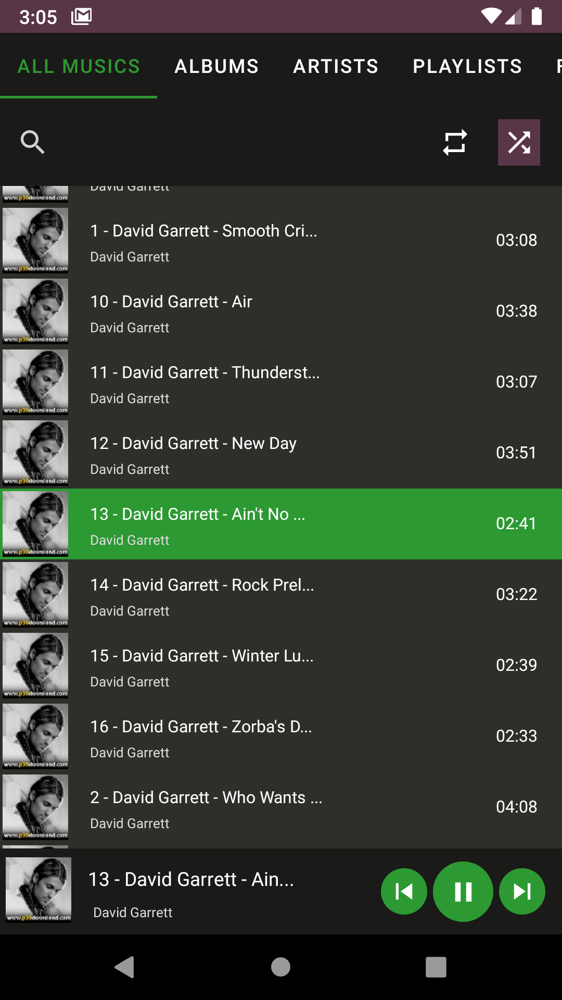
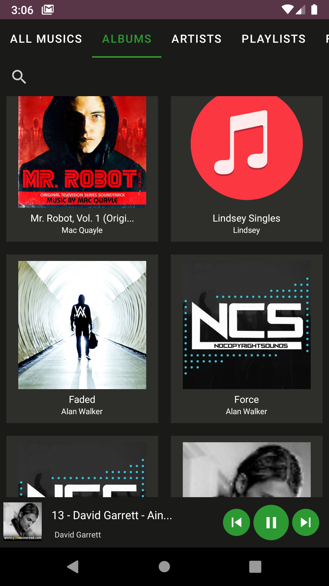
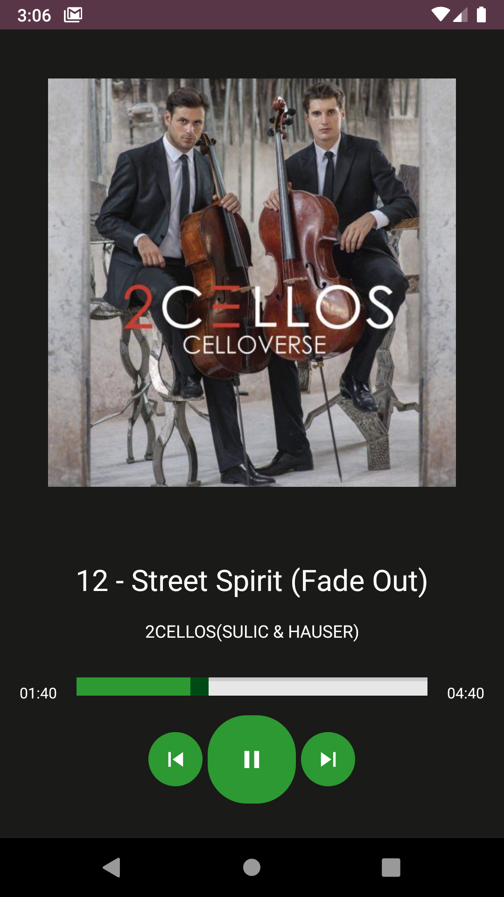

# MusicPlayer

### Simple Android Music Player

 

| Main View | Album View | Track View |
|--|--|--|
|  |  |  |

 - Main View :  Find all musics and show them in first page.
 - Albums: Show all allAlbums in a page.
 - Artists: Show all artist in a page.
 - Playlist: (not completed)
 - File Explorer: (not completed)
 - MVVM Architecture
 - Using LiveData and DataBinding

 

 ## Features
 - [x] Get musics form storage and show covers
 - [x] Filter by album and allArtists.
 - [x] Shuffle
 - [x] Reapeating modes
 - [x] Search between all
 - [x] Play next and previous music
 - [x] Service
 - [ ] Lyrics
 - [ ] Playlist
 - [ ] File Explorer
 - [ ] Work with headphone buttons
 ## External Libraries
 - Material
 - Piccasso
 - GreenDAO
